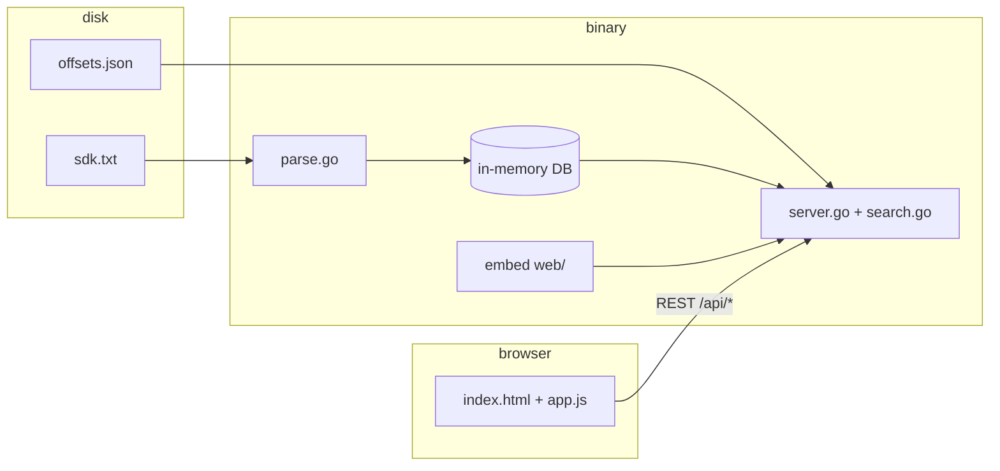

# SDK Viewer

Single Go binary with an embedded web UI for browsing Unreal Engine SDK offset dumps: C++-style `namespace Class { inline uint64_t Field = 0x…; // Type }` files, optional JSON export, full-text search, and a read-only **Important Offsets** panel driven by `offsets.json`.

Prebuilt binaries (no Go required):

| Platform | Path |
| --- | --- |
| Windows x64 | [`releases/windows-amd64/sdkviewer.exe`](releases/windows-amd64/sdkviewer.exe) |
| Linux x64 | [`releases/linux-amd64/sdkviewer`](releases/linux-amd64/sdkviewer) |

Bring your own `sdk.txt` (or use [`sample-sdk.txt`](sample-sdk.txt) to try the UI). Game dumps are often large and are **not** included in this repo.

---

## How it works



1. **Startup** — The server reads the dump once (~100–200 ms for multi‑MB files), builds indexes (classes, fields, offsets, types), and optionally loads `offsets.json` for pinned offsets, `_meta` (game build badge), and `_code` (syntax-highlighted snippets).

2. **Embedded UI** — HTML, CSS, JS, and fonts live under `web/` and are baked into the binary with `go:embed`. Each build gets a short **UI hash** (`ui_build` in `/api/stats`, `?v=` on `/app.js` and `/style.css`) so proxies and browsers do not stick on stale assets after you redeploy.

3. **Hot reload** — With `-watch` (default), changes to `sdk.txt` or `offsets.json` on disk are detected every ~2 s; the parser or offsets file reloads without restarting the process. The UI polls `/api/stats` and refreshes when the dataset etag changes.

4. **Search** — Queries hit an in-memory index (`search.go`): substring and token rules (`type:`, `class:`, `0x…`, `Class::Field`), with Important Offset entries ranked first.

5. **Deploy shape** — One executable plus data files beside it (or paths via flags). Linux production install uses `deploy/install-ubuntu.sh` → `/opt/sdkviewer`, systemd user `sdkviewer`, default listen `0.0.0.0:1336`.

### Repository layout

| Path | Role |
| --- | --- |
| `main.go` | Flags, embed FS, watch loops, browser open |
| `parse.go` | TXT/JSON dump parser |
| `search.go` | Query parsing and ranking |
| `server.go` | HTTP routes and JSON API |
| `offsets.go` | Read-only `offsets.json` loader |
| `static.go` | UI cache busting and cache headers |
| `web/` | Frontend (virtualised class list, tables, search) |
| `deploy/` | `install-ubuntu.sh`, `sdkviewer.service` |
| `releases/` | Prebuilt Windows and Linux amd64 binaries |

---

## Quick start (Windows)

```powershell
cd sdkviewer-github
.\releases\windows-amd64\sdkviewer.exe -file sample-sdk.txt -open
```

Or build from source (Go 1.22+):

```powershell
go build -o sdkviewer.exe .
.\sdkviewer.exe -file path\to\sdk.txt -open
```

Double-click [`run.bat`](run.bat) to build and open the default `sdk.txt` next to the exe.

## Quick start (Linux)

```bash
chmod +x releases/linux-amd64/sdkviewer
./releases/linux-amd64/sdkviewer -file sample-sdk.txt -addr 127.0.0.1:8080
```

Copy your real dump:

```bash
cp /path/to/sdk.txt .
./releases/linux-amd64/sdkviewer -addr 0.0.0.0:1336
```

## CLI flags

| Flag | Default | Meaning |
| --- | --- | --- |
| `-file` | `sdk.txt` next to the binary, then `./sdk.txt` | Dump path (`.txt` or JSON export from this tool) |
| `-addr` | `127.0.0.1:8080` | Listen address (`0.0.0.0:1336` for LAN/server) |
| `-offsets` | `offsets.json` next to the binary | Read-only Important Offsets |
| `-open` | `false` | Open the UI in the default browser |
| `-watch` | `true` | Re-parse when `-file` / offsets change on disk |
| `-export path` | | Write parsed JSON and exit (`-pretty` to indent) |

## Ubuntu server (systemd)

From Windows, cross-compile and pack deploy files:

```powershell
.\build-linux.bat
```

Upload `dist\linux\` to the server, then:

```bash
cd ~/sdkviewer
chmod +x install-ubuntu.sh
sudo ./install-ubuntu.sh
```

Installs to `/opt/sdkviewer`, enables `sdkviewer.service` on port **1336**, opens firewall if `ufw`/`firewalld` is present.

After updating **only the binary** (UI is inside the exe):

```bash
sudo install -m 755 ./sdkviewer /opt/sdkviewer/sdkviewer
sudo systemctl restart sdkviewer
curl -s http://127.0.0.1:1336/api/stats   # should include "ui_build":"…"
```

### Domain + Cloudflare

Cloudflare’s proxy does not forward arbitrary ports to HTTPS. Use a **Cloudflare Tunnel** to `localhost:1336`, or an **Origin Rule** that rewrites destination port to **1336** with DNS proxied and SSL mode **Flexible**. If the domain shows an old UI but `curl` on the server shows a new `ui_build`, purge **Caching → Purge Everything** once.

Apache/nginx in front is optional (reverse proxy to `127.0.0.1:1336`); direct `http://SERVER-IP:1336` does not go through Apache.

---

## Important Offsets (`offsets.json`)

Read-only on the web. Edit the file on the server; it reloads automatically.

- Normal groups (`core`, `player`, …) → hex offsets in the table.
- Keys starting with `_` are metadata: `_meta` (version/date badge), `_code` (highlighted code cards linked to entries via `"for"`).

See the included [`offsets.json`](offsets.json) for a full example (meta, decrypt snippet, grouped offsets).

---

## HTTP API

| Endpoint | Description |
| --- | --- |
| `GET /api/stats` | Counts, parse time, source path, **`ui_build`** |
| `GET /api/classes` | Class list (gzip + ETag) |
| `GET /api/class/{name}` | Fields for one class |
| `GET /api/search?q=…` | Ranked hits with source previews |
| `GET /api/source?from=&to=` | Raw dump lines |
| `GET /api/types` | Type histogram |
| `GET /api/export.json` | Full dataset JSON |
| `GET /api/offsets` | Important Offsets snapshot |
| `POST /api/reload` | Force re-parse (optional; watch mode usually enough) |

Deep links: `#/ClassName`, `#/ClassName/FieldName`, `#/!important/group/Name`.

---

## Search cheatsheet

| Query | Matches |
| --- | --- |
| `health` | Substrings in class or field names (all words required) |
| `0x5a0` / `offset:5a0` | Exact offset |
| `FortPawn::Health` | Class + field filters |
| `type:bool speed` | Type + name |
| `class:Zipline` / `in:Zipline` | Class name filter |

---

## Build both release binaries

```powershell
.\build-windows.bat
.\build-linux.bat
```

Linux output is under `dist/linux/` (installer bundle). Copy `dist/linux/sdkviewer` into `releases/linux-amd64/` when cutting a GitHub release, or use the copy already in `releases/`.

---

## License

No license file is included yet. Add one (e.g. MIT) before publishing if you want others to reuse the code.
